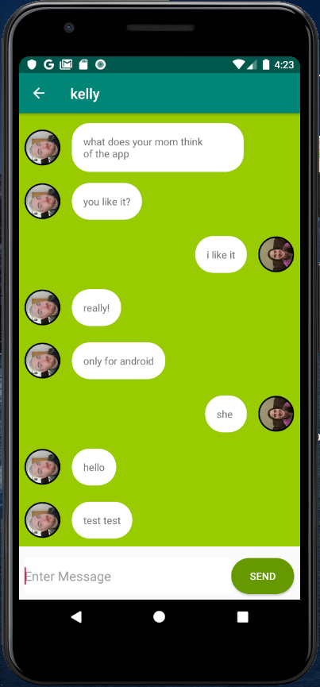
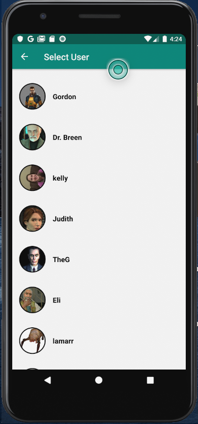

[Home](https://vanfleet0351.github.io/Kyle-Van-Fleet-Portfolio/)

# TutorMe Android App
TutorMe was developed in a 3 person team as part of a semester long class project. The team was charged with designing and developing a mobile application that uniquely met a clear need in today’s markets, was well-designed, had a UI, have at least three domain objects, have data that persists throughout multiple user sessions, use at least one Internet-based service, and Must use at least one device sensor.

### About the App
Our App helps tutors and students seeking a tutor to easily find each other. With our app, tutors will no longer have to print and post fliers with their phone numbers all around campus. Students who are struggling with a class will no longer have to desperately search bulletin boards on campus hoping to find a tutor that can help them. Tutors only need to create an account and list the subjects they are tutoring, and students only need to create and account and list the classes they need help with. 

After creating an account, a student will be presented with a group of tutors that are willing to help them. The student can swipe through the profiles of the tutors that are teaching the subject they want and select the one they like the most. A dialog will then be started to allow the student and tutor to set up a time, meeting place, and hourly rate they can agree upon.

The students can also use our app to meet with other students to form study groups. A student wishing to start a study group just needs to create a group on our app and all other students searching for study groups in the same subject will have the option to join their study group.

[Home](https://vanfleet0351.github.io/Kyle-Van-Fleet-Portfolio/)
